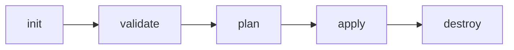

# Terraform on AWS with SRE & IaC Devops - Real World 20 Demos
<!-- TOC -->
* [Terraform on AWS with SRE & IaC Devops - Real World 20 Demos](#terraform-on-aws-with-sre--iac-devops---real-world-20-demos)
  * [Terraform Basics](#terraform-basics)
* [Terraform Command Basics](#terraform-command-basics)
  * [Step-01: Introduction](#step-01-introduction)
  * [Step-02: Review terraform manifest for EC2 Instance](#step-02-review-terraform-manifest-for-ec2-instance)
  * [Step-03: Terraform Core Commands](#step-03-terraform-core-commands)
  * [Step-04: Verify the EC2 Instance in AWS Management Console](#step-04-verify-the-ec2-instance-in-aws-management-console)
  * [Step-05: Destroy Infrastructure](#step-05-destroy-infrastructure)
  * [Step-08: Conclusion](#step-08-conclusion)
<!-- TOC -->


## Terraform Basics
Terraform Workflow


1. init - initialize the project
2. validate - validate the terraform configuration
3. plan - create execution plan
4. apply - apply changes
5. destroy - destroy the Terraform managed infra resources

# Terraform Command Basics

## Step-01: Introduction
- Understand basic Terraform Commands
    - terraform init
    - terraform validate
    - terraform plan
    - terraform apply
    - terraform destroy

## Step-02: Review terraform manifest for EC2 Instance
- **Pre-Conditions-1:** Ensure you have **default-vpc** in that respective region
- **Pre-Conditions-2:** Ensure AMI you are provisioning exists in that region if not update AMI ID
- **Pre-Conditions-3:** Verify your AWS Credentials in **$HOME/.aws/credentials**

```terraform
# Terraform Settings Block
terraform {
  required_providers {
    aws = {
      source  = "hashicorp/aws"
      version = "~> 5.36.0"
    }
  }
}


# Provider Block
provider "aws" {
  profile = "default" # AWS Credentials Profile configured on your local desktop terminal  $HOME/.aws/credentials
  region  = "us-east-1"
}

# Resource Block
resource "aws_instance" "ec2demo" {
  ami           = "ami-04d29b6f966df1537" # Amazon Linux in us-east-1, update as per your region
  instance_type = "t2.micro"
}
```

## Step-03: Terraform Core Commands
```shell
# Initialize Terraform
terraform init

# Terraform Validate
terraform validate

# Terraform Plan to Verify what it is going to create / update / destroy
terraform plan

# Terraform Apply to Create EC2 Instance
terraform apply -auto-approve
```

## Step-04: Verify the EC2 Instance in AWS Management Console
- Go to AWS Management Console -> Services -> EC2
- Verify newly created EC2 instance


## Step-05: Destroy Infrastructure
```terraform
# Destroy EC2 Instance
terraform destroy

# Delete Terraform files 
rm -rf .terraform*
rm -rf terraform.tfstate*
```

## Step-08: Conclusion
- Re-iterate what we have learned in this section
- Learned about Important Terraform Commands
    - terraform init
    - terraform validate
    - terraform plan
    - terraform apply
    - terraform destroy     

## Section 3: Terraform Settings, Providers and Resources

## Section 4: Terraform Input Variables, Data sources and Output Values

## Section 5: Terraform Loops, MetaArguments, Splat Operator and Functions 

## Section 6: AWS VPC 3-Tier Architecture Design using Terraform

## Section 7: AWS EC2 Instances and Security Groups with Terraform

## Section 8: AWS Classic Load Balancer with Terraform

## Section 9: AWS Application Load Balancer Basics with Terraform
## Section 10: AWS ALB Context Path Based Routing using Terraform

## Section 11: AWW ALB Host Header Based Routing using Terraform

## Section 12: AWS ALB Query String, Host Header Redirects and Custom Header Routing

## Section 13: AWS DNS to DB using Terraform
## Section 14: AWS Autoscaling with Launch Templates using Terraform


## Section 15: AWS Network Load Balancer with Autoscaling Groups using Terraform

## Section 16: AWS CloudWatch Alarms, Synthetics using Terraform

## Section 17: Develop Local Terraform Re-usable Modules

## Section 18: Develop Local Terraform Module from Scratch

## Section 19: Terraform Remote State Storage with AWS S3 and DynamoDB

## Section 20: Terraform Remote State Datasource with Two Projects - Demo

## Section 21: AWS IaC DevOps with CodePipeline, CodeBuild and Github
